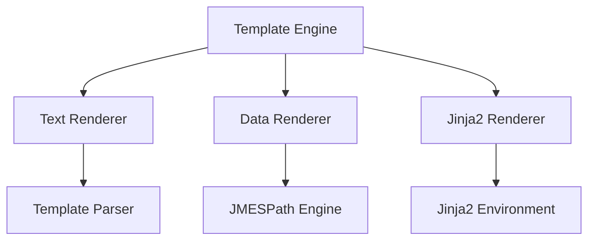
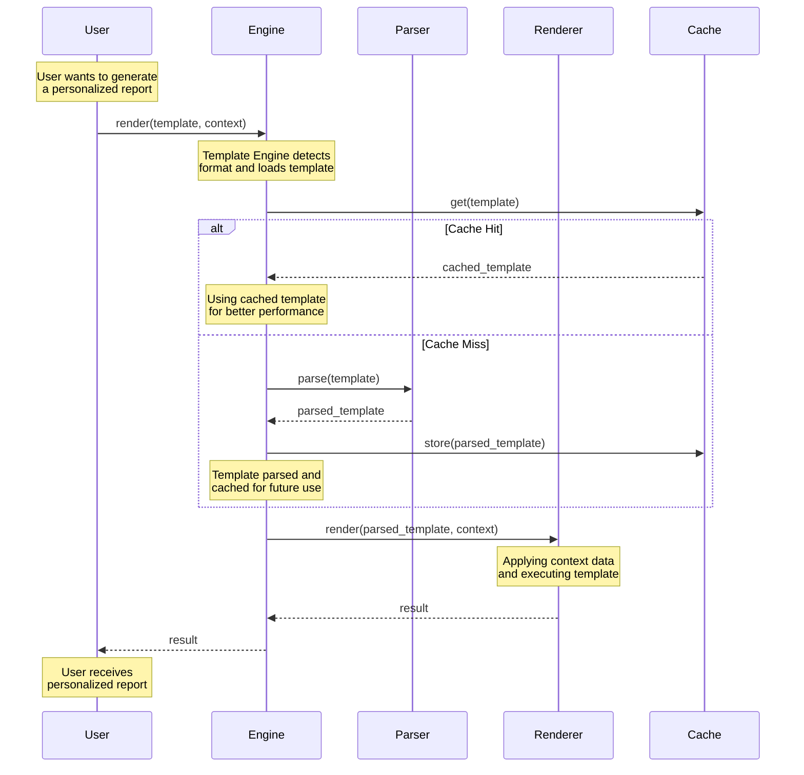

# Architecture

This document describes the architecture and design of the Templify library, focusing on practical use cases and real-world scenarios.

## Overview

Templify is designed as a modular and extensible templating library that supports multiple template formats and data structures. The architecture follows clean architecture principles with clear separation of concerns.

## System Components

### Core Components



#### 1. Template Engine
**Purpose**: Central coordinator for all template operations
**Responsibilities**:
- Route templates to appropriate renderer based on format
- Manage template lifecycle (loading, caching, rendering)
- Provide unified API for all template types
- Handle error propagation and recovery

**Example Use Case**:
```python
# Template Engine automatically detects format and routes to appropriate renderer
from templify import render

# Text template
result1 = render("Hello, {name}!", {"name": "Alice"})

# Data structure template
result2 = render({
    "user": {"name": "{name}"},
    "settings": {"theme": "{theme}"}
}, {"name": "Alice", "theme": "dark"})

# Jinja2 template
result3 = render("""
    
        Welcome, Administrator {{ user.name }}!
    
""", {"user": {"name": "Alice", "is_admin": True}})
```

#### 2. Text Renderer
**Purpose**: Handle simple text-based templates with placeholders
**Responsibilities**:
- Process basic string interpolation
- Handle escape sequences and special characters
- Support default values and optional variables
- Optimize for high-performance text processing

**Example Use Case**:
```python
# Simple text template with defaults
template = "Welcome, {name}! Your balance is {balance:0.00}"
context = {"name": "Alice"}
result = render_text(template, context)
# Result: "Welcome, Alice! Your balance is 0.00"

# Text template with escaping
template = "Path: {path}"
context = {"path": "C:\\Users\\Alice"}
result = render_text(template, context)
# Result: "Path: C:\Users\Alice"
```

#### 3. Data Renderer
**Purpose**: Process structured data templates with JMESPath support
**Responsibilities**:
- Transform complex data structures
- Execute JMESPath queries
- Handle recursive template application
- Validate data types and structure

**Example Use Case**:
```python
# Complex data transformation
template = {
    "summary": {
        "total_sales": "{{ sales | jmespath('sum(@[].amount)') }}",
        "top_product": "{{ products | jmespath('max_by(@, &revenue).name') }}"
    },
    "recent_orders": "{{ orders | jmespath('sort_by(@, &date)[-3:]') }}"
}

context = {
    "sales": [
        {"amount": 100, "date": "2024-01-01"},
        {"amount": 200, "date": "2024-01-02"}
    ],
    "products": [
        {"name": "Product A", "revenue": 1000},
        {"name": "Product B", "revenue": 2000}
    ],
    "orders": [
        {"id": 1, "date": "2024-01-01"},
        {"id": 2, "date": "2024-01-02"},
        {"id": 3, "date": "2024-01-03"},
        {"id": 4, "date": "2024-01-04"}
    ]
}
```

#### 4. Jinja2 Renderer
**Purpose**: Provide full Jinja2 template capabilities
**Responsibilities**:
- Execute Jinja2 templates with inheritance
- Manage template includes and macros
- Handle custom filters and extensions
- Support template caching

**Example Use Case**:
```python
# Template inheritance
base_template = """

    Welcome, {{ user.name }}!

"""

child_template = """


    {{ super() }}
    Your recent activity:
    
        - {{ activity.type }}: {{ activity.description }}
    

"""

# Custom filter
@jinja2_env.filter
def format_currency(value):
    return f"${value:,.2f}"

# Usage
template = "Total: {{ amount | format_currency }}"
context = {"amount": 1234.56}
```

## Data Flow



## Extension Points

### 1. Custom Template Formats
**Purpose**: Allow users to add support for new template formats
**Example**:
```python
class CustomTemplateParser(TemplateParser):
    def parse(self, template: str) -> ParsedTemplate:
        # Parse custom template format
        pass

    def validate(self, template: str) -> bool:
        # Validate custom template syntax
        pass

# Register custom parser
template_engine.register_parser("custom", CustomTemplateParser())
```

### 2. Custom Renderers
**Purpose**: Support new output formats or rendering strategies
**Example**:
```python
class PDFRenderer(Renderer):
    def render(self, template: ParsedTemplate, context: Dict) -> bytes:
        # Generate PDF from template
        pass

# Register PDF renderer
template_engine.register_renderer("pdf", PDFRenderer())
```

### 3. Custom Filters
**Purpose**: Add custom data transformation capabilities
**Example**:
```python
@template_engine.register_filter
def format_date(value: datetime) -> str:
    return value.strftime("%Y-%m-%d")

# Usage in template
template = "Last updated: {{ date | format_date }}"
```

## Error Handling

### 1. Template Errors
**Purpose**: Provide clear feedback for template-related issues
**Example**:
```python
try:
    result = render("Hello, {name}!", {})
except TemplateError as e:
    print(f"Template error: {e.message}")
    print(f"Missing variables: {e.missing_variables}")
```

### 2. Runtime Errors
**Purpose**: Handle context and execution errors gracefully
**Example**:
```python
try:
    result = render_data({
        "total": "{{ sales | jmespath('sum(@[].amount)') }}"
    }, {"sales": None})
except RuntimeError as e:
    print(f"Runtime error: {e.message}")
    print(f"Error context: {e.context}")
```

## Performance Considerations

### 1. Caching Strategy
**Purpose**: Optimize template processing for repeated use
**Example**:
```python
# Template is parsed once and cached
template = "Hello, {name}!"
context1 = {"name": "Alice"}
context2 = {"name": "Bob"}

# Both renders use cached parsed template
result1 = render(template, context1)
result2 = render(template, context2)
```

### 2. Optimization Techniques
**Purpose**: Improve rendering performance for large templates
**Example**:
```python
# Pre-compile complex template
template = """

    
        {{ user.name }}: {{ user.balance | format_currency }}
    

"""
compiled = template_engine.compile(template)

# Use compiled template for better performance
for batch in user_batches:
    result = compiled.render(batch)
```

## Security

### 1. Template Security
**Purpose**: Prevent template-based security vulnerabilities
**Example**:
```python
# Sandboxed template execution
template = """

{{ os.system('rm -rf /') }}
"""
# Raises SecurityError: Import of 'os' not allowed
```

### 2. Data Security
**Purpose**: Protect sensitive data in templates
**Example**:
```python
# Context isolation
template = "{{ user.password }}"  # Raises SecurityError
template = "{{ user.name }}"      # Allowed
```

## Future Extensions

### 1. Planned Features
**Purpose**: Enhance template capabilities
**Example**:
```python
# Future PDF generation
template = """
# Invoice
Customer: {{ customer.name }}
Items:

- {{ item.name }}: {{ item.price }}

"""
result = render(template, context, format="pdf")
```

### 2. Potential Improvements
**Purpose**: Optimize for specific use cases
**Example**:
```python
# Future async rendering
async def generate_reports(templates, contexts):
    tasks = [
        render_async(template, context)
        for template, context in zip(templates, contexts)
    ]
    return await asyncio.gather(*tasks)
```

## Dependencies

### Core Dependencies
- Jinja2: Template engine for complex templating
- JMESPath: Data querying for transformations
- typing: Type hints for better IDE support
- dataclasses: Data structure handling

### Development Dependencies
- pytest: Testing framework
- black: Code formatting
- ruff: Linting
- mypy: Type checking

## Testing Strategy

### 1. Unit Tests
**Purpose**: Verify individual component behavior
**Example**:
```python
def test_text_renderer():
    renderer = TextRenderer()
    result = renderer.render("Hello, {name}!", {"name": "Alice"})
    assert result == "Hello, Alice!"
```

### 2. Integration Tests
**Purpose**: Verify component interactions
**Example**:
```python
def test_template_engine():
    engine = TemplateEngine()
    result = engine.render(
        "{{ user.name }} has {{ orders | length }} orders",
        {
            "user": {"name": "Alice"},
            "orders": [1, 2, 3]
        }
    )
    assert result == "Alice has 3 orders"
```

### 3. Property Tests
**Purpose**: Verify template properties
**Example**:
```python
@given(st.text(), st.dictionaries(st.text(), st.text()))
def test_template_properties(template, context):
    result = render(template, context)
    assert isinstance(result, str)
    assert len(result) >= 0
```
